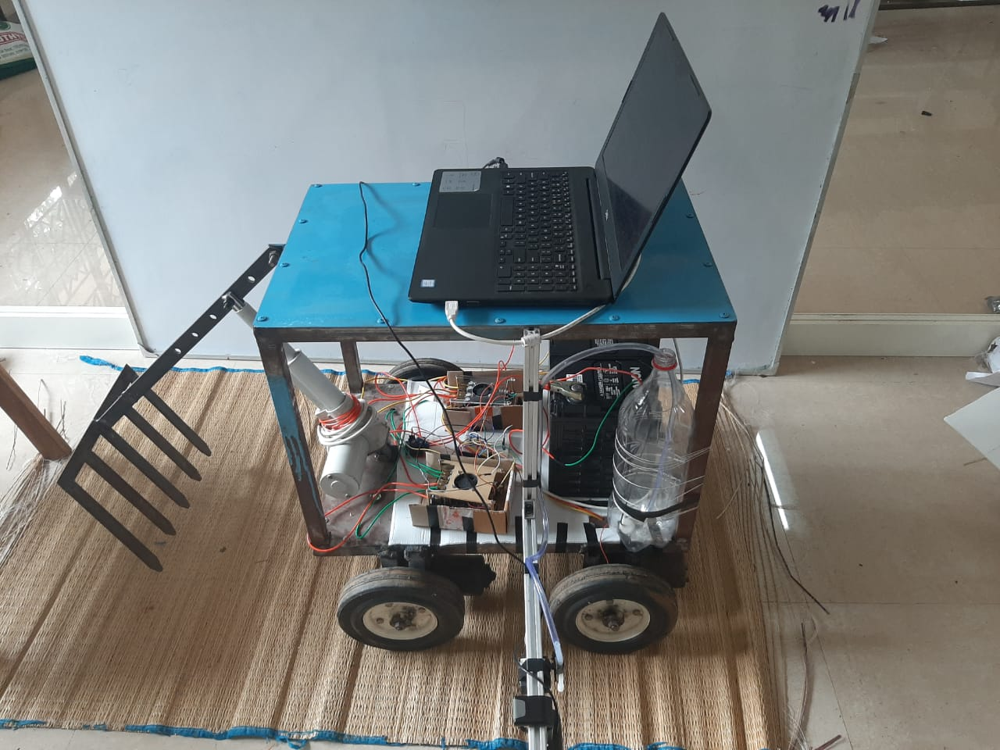
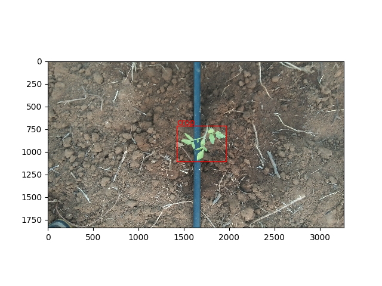

# Precision Agriculture Bot

An agriculture bot we are developing which can help in controlling weed population in farm by identifying crops and weeds apart using our CNN model, then removing the weed or supplying crops with fertilizers.

We built a four wheel drive robot with a camera places in the side to identify crops and weeds as it moves along the rows of crops.

Till now we have built our detection model and preliminary control for our robot, need to integrate both parts.

Faster RCNN model output: 

